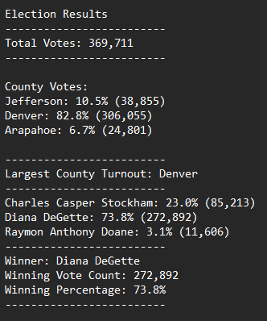

# Election Audit with Python

## Overview of Project

The purpose of this project was to assist Tom, a Colorado Board of Elections employee, with an audit on election data. The data included election results from a U.S. Congressional precinct. We were tasked with:
1. Calculating the total number of votes casted.
2. Supplying a complete list of candidates who received votes.
3. Calculating the percentage of votes each candidate won.
4. Calculating the total number of votes each candidate received.
5. Calculating the voter turnout for each county.
7. Calculating the percentage of votes from each county out of the total.
8. Determine the county with the largest turnout.
5. Determine the winner of the election based on popular vote.

## Results

After conducting our analysis on the election data, we determined that:
- 369,711 total votes were casted in this election.
  
- Voter turnout by county:
    - 10.5% (38,855) of voters were in Jefferson county.
    - 82.8% (306,055) of voters were from the county of Denver.
    - 6.7% (24,801) of voters were in Arapahoe county.
  
- The county with the biggest turnout was Denver, contributing a total of 306,055 votes (82.8%) to the total count.
  
- Three total candidates: 
    - Charles Casper Stockham
    - Diana DeGette
    - Raymon Anthony Doane
  
- The results for each candidate:
    - Charles Casper Stockham received 23.0% of votes, totaling 85,213.
    - Diana DeGette received the most amount of votes, awarding her with 73.8%, and totaling 272,892.
    - Raymon Anthony Doane received the least amount of votes, only 3.1%, and totaling 11,606.
  
- Diana DeGette was declared the winner
  
#### All above analysis can be seen in the image below 
 

## Election-Audit Summary
Our election audit provides key information that depicts total votes, the most favored candidate, and which county had the largest turnout. It also highlights the winner and reiterates the total votes they received. However, like with any script, it can be taken a step further for deeper analysis.
  
We can make modifications to this script to:
1. Determine how many votes each candidate obtained from each county
2. List the county with the smallest voter turnout (Arapahoe), which may be ideal with a bigger dataset  

Although our dataset was limited to Ballot ID's, county name, and candidate, we would be able to come to further conclusions if provided with other location data. These may include zip codes, cities, and states. This script can be reused for any similar election, or adjusted to conform to different election standards. As for other elections, such as a presidential race, counties can be changed to states to calculate voter turnout by state, as well as total votes and percentage each presidential candidate received from each state.
